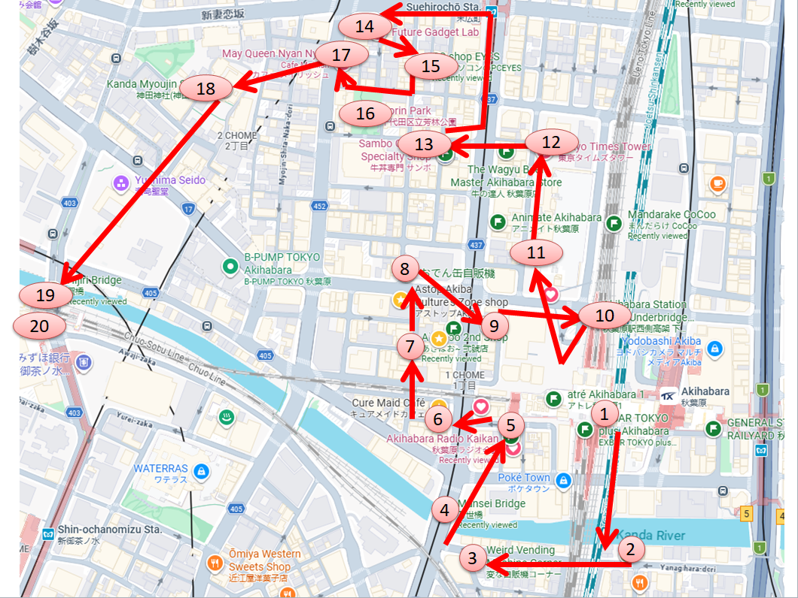

# An Optimized *Steins;Gate* Pilgrimage Through Akihabara

> **Spoilers:** This guide references major locations and events from *Steins;Gate*, *Steins;Gate 0*, and *Linear Bounded Phenogram*.

Late last week, I posted a summary of my experience at the *Steins;Gate* Anime 15th Anniversary Exhibition at UDX Akiba Square in Akihabara. After leaving the exhibition—which I cover in greater detail in [this Reddit post](https://www.reddit.com/r/steinsgate/comments/1uytdkh/a_summary_of_my_trip_to_the_sg_anime_15th/)—I spent a little more time wandering around Akiba and revisiting several places connected to the franchise I love so much.

On Monday, with the day off for Marine Day, I returned to Akihabara for the rooftop celebration marking the 12th anniversary of Radio Kaikan's reconstruction. The event coincided with the beginning of the building's *STEINS;GATE RE:BOOT* takeover and featured Haruko Momoi (Faris NyanNyan's VA) as its special guest.

Before heading out, however, I carefully researched the pilgrimage sites I had missed during my first visit. As a computer engineer, my mind immediately jumped to the Seven Bridges of Konigsberg while I tried to arrange everything into the most efficient walking route possible. This was not exactly an Eulerian-path problem (and was probably closer to a smaller version of the traveling salesman exercise) but the goal was the same: visit as many meaningful locations as possible while minimizing backtracking.

This post follows the route I took. I would call it **near-optimal**, and I am absolutely open to further improvements. The walking itself can be completed in roughly two hours at a walking pace, but a more realistic visit will take over three if you factor in photographs, shrine or shop visits, eating at Sanbo, or stopping at Cafe Mai:lish.

Each numbered marker on the map below corresponds to a section of this guide. I have included notes about the scenes associated with each location, basic directions between stops, and a few optional detours that do not appear directly in *Steins;Gate* but are interesting enough in my opinion to justify the extra few minutes.

---

## START: Akihabara Station

Akihabara Station serves as the central hub of Tokyo's famous Electric Town (not to be confused with [my hometown, the Electric City](https://www.youtube.com/watch?v=cS9qCre_sv8)). The neighborhood grew from its postwar radio-parts markets into one of the world's best-known centers for electronics, computers, games, anime, and other branches of otaku culture. The Akihabara of today may contain far more character goods shops and maid cafes than it did during the height of its electronics era, but traces of the older district remain in the cramped component stores, cluttered signs, narrow alleys, and shops selling objects whose purposes are not immediately obvious.

*Steins;Gate* captures that mixture exceptionally well. I first watched the anime before I really understood what Akihabara was, and I was immediately fascinated by the idea of a neighborhood where maid cafes, electronics shops, university students, hackers, and questionable scientific experiments could all exist within a few blocks of one another. The Future Gadget Laboratory in particular felt strangely cozy and familiar to me, almost like an exaggerated version of the rooms where I spent my childhood taking apart electronics and making games on the family computer.

Akihabara Station is the natural place to begin. I've seen other routes recommend starting at Iwamotocho Station because it places you near the southeastern edge of the pilgrimage area, but doing so makes it more difficult to include both Kanda Fureai and Mansei Bridges without some degree of backtracking.

As a bonus, be sure to collect the Akihabara Station eki stamp if you're a collector! There are four total stamps associated with the series that you can collect along this path, and this is the first.

From Akihabara Station, leave through the **Central South Exit** and head toward the Kanda River. The first destination is only a few minutes away.

## 1. Kanda Fureai Bridge

Kanda Fureai Bridge appears repeatedly throughout the anime and visual novel, where Okabe and Mayuri encounter a barricade while attempting to carry their newly acquired “intelligence corn” back to the Lab. Later, the bridge becomes the meeting point for Okabe and Luka's date. It also appears during considerably darker portions of the story. The bridge is easy to recognize from its railings, unusual steps, the surrounding buildings, and the way the elevated railway and Kanda River frame the view.

Cross the bridge toward the south side of the river. At the end, turn left and follow the street to the entrance of Yanagimori Shrine.

## 2. Yanagimori Shrine

Yanagimori Shrine supplies the real-world location (and parts of the exterior  and immediate interior design) for the Yanabayashi Shrine from the series, where Luka lives and where the IBN 5100 is initially kept. The small gate, steep steps immediately within the gate, retaining walls, and cramped placement beside the river are immediately recognizable, although the shrine grounds themselves are a long shot from what's shown in the series. In Steins;Gate, Yanabayashi Shrine is actually a composite location where Yanagimori Shrine serves as the placement and exterior setting reference whereas Kanda Myojin (which we visit later on in this guide) serves as the interior visual inspiration.

After leaving the shrine, cross the street and continue west along Yanagihara-dori toward Manseibashi.

## 3. The “Creepy Vending Machine Corner” *(optional—not from Steins;Gate)*

Shortly before reaching Manseibashi, you will pass one of Akihabara's strangest collections of vending machines. This stop is not connected to *Steins;Gate*, but it is such an unusual fragment of old Akiba that I think it belongs on the route anyway and is often overlooked by tourists. The machines sell an ever-changing assortment of objects that may include canned candy, toy insects, model trains, and opaque “mystery boxes” covered in crude jokes or bizarre short stories. The area is cluttered with stickers, graffiti, discarded packaging, and machines positioned at awkward angles, with some sections reachable only by squeezing through narrow gaps. It truly lives up to the name (searchable on Google Maps under the name "Weird Vending Machine Corner") and is rivaled in uniqueness only by the [Sagamihara Used Tire Mart]([https://www.tire-ichiba.co.jp/shopinfo.html](https://www.japantripmap.com/kanagawa-province/attraction/used-tire-mart-sagamihara-store)).

I've been told that this area is considerably stranger after dark.

Continue west until the street meets Chuo-dori and the Kanda River at Manseibashi.

## 4. Manseibashi Bridge

By the time you reach Chuo-dori, Manseibashi will be immediately visible on the right. The bridge appears several times in *Steins;Gate*, most memorably when Okabe and Kurisu carry the large cardboard box containing the IBN 5100 over it.

From Manseibashi, follow Chuo-dori north toward Akihabara Station. Radio Kaikan will soon appear on the right.

## 5. Akihabara Radio Kaikan

Radio Kaikan is the single most important real-world landmark in *Steins;Gate*. It is where Okabe and Mayuri attend Dr. Nakabachi's time-travel presentation, where Okabe first meets Kurisu, and where the discovery of her body initiates the chain of events that pop off the story.

The building standing here today is not the exact structure seen in the original game and anime. The old Radio Kaikan closed in 2011 and was replaced by the current building, which opened in 2014. The new version is taller and more modern, but it occupies the same site and preserves the famous yellow-and-red **世界のラジオ会館 秋葉原** signage, making it unmistakable. [Photos of the old building](https://photoakiba.jp/special/radio/menu.htm) show the characteristic old staircase and rooms remeniscent of the visual novel and anime backgrounds. Despite the major changes, it's still worth shopping around inside for otaku goods!

After leaving Radio Kaikan, walk west toward Chuo-dori and look north toward the railway bridge carrying the Chuo-Sobu Line over the street.

## 6. Chuo-Sobu Line Bridge and the *Phenogram* Manhole

The railway bridge over Chuo-dori appears throughout *Steins;Gate* media and is one of the most recognizable pieces of Akihabara's streetscape. The bridge also appears in *Steins;Gate 0*, where the structure collapses into the street during the conflict over the time machine.

This area contains a smaller pilgrimage detail that is easy to miss: an otherwise ordinary manhole cover associated with Daru's story in *Steins;Gate: Linear Bounded Phenogram*. Although many of the manholes in this area look similar, the one with the correct code should be located in one of the alleyways near the LAOX building.

Continue through the nearby side streets toward Akibaoo's second shop.

## 7. Akibaoo 2nd Shop *(optional)*

Akibaoo 2nd Shop appears as a background location in the *Steins;Gate 0* anime. It is not associated with one of the franchise's largest plot events, but it is a fun stop because it represents the type of densely stocked, slightly chaotic electronics-and-variety store that defines the older image of Akihabara.

From here, continue north through the backstreets toward the canned oden vending machines.

## 8. Canned Oden Vending Machine *(optional, but relevant)*

Canned oden is one of the small details that helps ground *Steins;Gate* in the real Akihabara of its era. Mayuri brings canned oden to the lab while Daru is working, and she and Okabe later share it on the rooftop. Not necessary, but fun and worthwhile if you've never had oden from a can before.

From the vending machines, head back southeast through the side streets toward the IBN 5100 coin locker location.

## 9. The IBN 5100 Coin Lockers

These are the lockers in which the IBN 5100 is hidden after disappearing from Yanabayashi Shrine.

Continue toward the passages beneath the railway tracks near Akihabara Station.

## 10. Beneath the Akihabara Station Tracks *(optional)*

The streets and passages beneath Akihabara's elevated railway lines appear repeatedly as transitional backgrounds throughout *Steins;Gate* and *Steins;Gate 0*, such as when Okabe and Faris are evading their persuers or when Okabe and Luka are on their date. Although not a major location, I thought it helped round out the area by giving me a better idea where parts of the story took place.

Walk slightly south towards the Electric Town North Exit, then take the elevated pedestrian route toward Akihabara UDX and Crossfield.

## 11. Akihabara Crossfield and the UDX Pedestrian Bridge

Akihabara Crossfield (the complex centered on Akihabara UDX) is represented in the series as the UPX area and appears from the opening episode onward. The bridge with its large video screen, broad plaza, escalators, and elevated pedestrian deck is one of the easiest locations to match with the visual novel and anime. Several conversations and establishing shots use this elevated viewpoint.

UDX itself is also where the 15th Anniversary Exhibition was held at Akiba Square, making it doubly relevant to this particular visit.

Leave the UDX deck on the west side via the escalators and continue north along Akiba Tashiro street.

## 12. Akiba Tashiro Street and Tokyo Times Tower

Akiba Tashiro Street is the backstreet running north behind the main Chuo Street shopping area. It appears throughout the series, and one of the most painful world-line variations occurs here when Mayuri is struck by a car. At the northern end of the street stands Tokyo Times Tower, the real-world model for the luxury high-rise where Faris lives.

From the tower area, head west toward the nearby side street containing Sanbo.

## 13. Beef Bowl Restaurant Sanbo

Sanbo is the real gyudon restaurant that appears in the series and one of the few pilgrimage locations where visitors can do more than photograph an exterior. The restaurant is small, old-fashioned, and direct: sit down, order beef, eat, and get out. Its yellow signage and compact interior are instantly recognizable. To order, insert cash into the vending machine just inside the sliding door, press the button corresponding to your order, and hand the ticket to the wait staff before taking your seat. The whole process is supposed to move along quickly, so be sure to consult the photos for pictures of the menu beforehand if you have trouble reading kanji so you don't hold up the line.

After Sanbo, continue north toward Kuramaebashi Street to search for the Future Gadget Laboratory.

## 14. The Future Gadget Laboratory—Following Kyouma's Directions

Rather than beginning with a fan-created map, I wanted to see where Okabe's own directions would lead. In the visual novel, he describes the lab approximately as follows: travel up Chuo Street from the station to Suehirocho, turn onto Kuramaebashi Street, and enter the alley before the traffic light. There, one should supposedly find the run-down Ohiyama Building, with the Braun Tube Workshop on the first floor and the Future Gadget Laboratory above it.

## 15. Alternate Future Gadget Lab Location *(optional)*

Many older pilgrimage maps identify a second nearby building or gated storefront as the closest visual reference for the Future Gadget Laboratory. This alternate marker does not align as neatly with Okabe's verbal directions, but portions of its exterior were historically similar to the lab's street-level appearance.

I have included it because it appears in so many earlier pilgrimage posts, but it's not a required stop.

From the lab area, walk south toward the small neighborhood park nearby.

## 16. Horin Park

Horin Park appears several times in the anime, often during conversations between Okabe and Kurisu near the lab. It is a modest residential park rather than a dramatic landmark, but its fence, play equipment, benches, and surrounding apartment buildings make it readily identifiable.

This is an active neighborhood park, so you should avoid taking photos. Take a moment to appreciate the area and continue west and north toward Cafe Mai:lish.

## 17. Cafe Mai:lish

Cafe Mai:lish is the real maid cafe that inspired MayQueen+Nyan², where Faris and Mayuri work. Both the exterior and portions of the interior influenced the fictional cafe, although the anime expands the space a bit.

Unlike most stops on this route, Mai:lish offers the opportunity to experience the inspiration from the inside. The cafe has maintained a long relationship with *Steins;Gate* and has frequently displayed franchise artwork, offered character-inspired menu items, and hosted collaborations. Mai:lish is also somewhat calmer than the other maid cafes in the area. Normal etiquette still applies (e.g., no taking pictures of the staff) and a minimum purchase of one drink is required. For my fellow stamp collecters, there's also a Faris-themed stamp available near the checkout counter!

From Cafe Mai:lish, head southwest toward Kanda Myojin.

## 18. Kanda Myojin Shrine

Kanda Myojin provides much of the visual inspiration for the fictional Yanabayashi Shrine. Its broader grounds and architecture resemble the version seen in the game and anime far more closely than the comparatively smaller interior of Yanagimori Shrine. Also, for you pilgrimage-stamp collectors, the EDOCCO cultural complex beside the shrine hosts the Anime Tourism Association's *STEINS;GATE* “88 Japanese Anime Spots” certification display and memorial stamp. At the time of writing, the stamp is still located on the basement level near the entrance to EDOCCO Studio. If you're like me and forgot your stamp book when you visit, you can always run to the nearby FamilyMart to pick up some Hagaki (post cards) to use, instead.

After exploring the shrine, leave toward Ochanomizu and walk to Hijiri Bridge.

## 19. Hijiri Bridge

Hijiri Bridge and the surrounding intersection appear in both *Steins;Gate* and *Steins;Gate 0* during the characters' movement between Akihabara and Ochanomizu, including some of the escape sequences.

Continue across the bridge toward Ochanomizu Station.

## 20. Ochanomizu and Shin-Ochanomizu Stations

The Ochanomizu area appears in the infamous scene in which Nae pushes Mayuri onto the tracks. Although this scene actually takes place in Shin-Ochanomizu Station, the eki stamp for this area can be collected outside the west gate of JR Ochanomizu Station.

Ochanomizu is also a convenient endpoint. From here, you can take the Chuo-Sobu Line one stop back to Akihabara or continue toward central Tokyo.

---

## Final Thoughts

What surprised me most about completing this route was not simply how many *Steins;Gate* locations still exist, but how close together they are. The characters' movements through Akihabara make sense: the lab, MayQueen, Sanbo, UDX, Radio Kaikan, the shrines, and the station really can form part of the same daily walking environment.

The neighborhood has undoubtedly changed since the original visual novel was released. Buildings have been replaced, signs have moved, stores have closed, and the old Radio Kaikan survives only through photographs and the newer structure on the same site. Yet enough of the streetscape remains that walking the route still feels like stepping into the physical world in which the fictional Akihabara from the series was built.

For me, that is what made the pilgrimage worthwhile. *Steins;Gate* does not merely set its story in Akihabara, it uses the actual neighborhood's locations so carefully that the setting becomes inseparable from the characters who act in it.

El Psy Kongroo.
